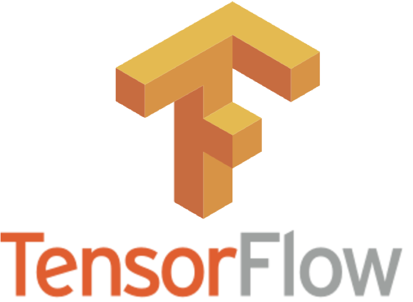

# Emerging Technologies Project
### Patrick Moran - g00179039
## [Contents](#contents) 

[Introduction](#intro)  
[Project Overview](#overview)   
[Live Demo](#demo)  
[Flask](#flask)  
[Tensorflow](#tensor)    
[Keras](#keras)  
[Running the Application](#run-app)  
[References](#references) 

## Introduction   
My name is Patrick Moran and this is my project repository for my Fourth Year Emerging Technologies Module. In this module we covered Python, Simple Linear Regression, Gradient Decent, TensorFlow and Keras.

[Top](#contents)  

## Project Overview 
For this project, a web application is created which recognises digits in images. The user can upload an image or draw an digit on a canvas and the application will respond with a prediction. The key components of this project are [Flask](http://flask.pocoo.org/) along with some [Bootstrap](https://getbootstrap.com/) and [Tensorflow](https://www.tensorflow.org/). The full project specifications can be found [here](https://emerging-technologies.github.io/problems/project.html).  Accuracy of approximately 99% is considered excellent in recognising digits, and this projects model accuarcy is 99.11% so sometimes it gets it wrong!.

#### Design
* On the left of the Home Page there is a canvas where the user can draw an digit (0-9). Directly underneath are two buttons:  
Predict - Predicts the digit drawn  
Clear - Clears the canvas.

* On the right of the Homepage, there is a file upload section. Simply click on "Choose File" and then select an image (png. jpg, jpeg or gif) from your computer that contains a digit. Then click "Predict" and you will recive a digit prediction.

* In the footer there is a link to an about page giving an overview of myself and the project.

[Top](#contents) 
## Live Demo

You can view the application running live by clicking [here](http://52.25.228.105/).

[Top](#contents) 

## Flask        
  

Flask is a web framework. Flask provides developers with tools, libraries and technologies that allows them to build web applications.

Flask is called a Micro-framework as it has little to no dependencies with external libraries. Some examples of applications that use the Flask framework are Pinterest and LinkedIn.

For more information about flask including great tutorials click [here](http://flask.pocoo.org/).

[Top](#contents) 

## Tensorflow  
  

Tensorflow is an open-source software library, developed by Google, for dataflow programming. Tensorflow is used for numerical computation using data flow graphs. Its also used for for machine learning applications such as neural networks. 

The basics behind tensorflow are; a model is created called a computational graph with tensorflow objects and then a tensorflow session is created which handles all of the computation.  

More information about tensorflow, including a large variety of tutorials for beginners and experts, can be found [here](https://www.tensorflow.org/).

[Top](#contents)   

## Keras 
  

Keras is an open-source neural networks API. Keras is written in python and is capable of running on top of a range of deep learning libraries. For this project Keras will be running on top of Tensorflow.

Keras was developed with the goal of fast experimentation. With Keras you can go from idea to result very quickly. Keras makes working with Tensorflow easier. Keras supports a higher level, more intuitive set of abstractions which make it easier to build neural networks. In 2017, Google officially supported Keras in Tensorflow's core library.

More information regarding Keras can be found [here](https://keras.io/).

[Top](#contents)   

## Running The Application  
Here are a set of instructions if you want to run this application on your own machine.

1. Clone or Download this Repository
2. Download and Install Anaconda.
    * Click [here](https://www.anaconda.com/download/) to go to the downloads page.
3. Next you need to download tensorflow.
    * Click [here](https://www.tensorflow.org/install/) and then select your OS. Then scroll down to "Installing with Anaconda" section and follow the instructions.

4. Navigate to where you have this project downloaded.
    * Navigate into the static folder and create a folder called "img".

5. On the comand line navigate to the root directory of the project and follow these instructions.  
    Type the command:
    > activate tensorflow    

    Followed by this command:
    > pip install -r requirements.txt
    * This will install all the requirments for this project in your tensorflow envoirnment.

6. The training model has allready been saved into the model folder but if you would like to see it running yourself:
    Navigate into the model folder and type the following command:
    > python train.py

    * \*\*NOTE\*\* - The model can take anything from 25-60 minutes to complete depending on the speed of your processor. However, if you wish to see all of the output from the training model including some result graphs, check out this notebook I made. Click [here](https://github.com/moranpatrick/Emerging-Technologies-Project/blob/master/TrainingModel.ipynb).

7. Now you are ready to run the web app.  
    Type the command:
    > python web-app.py

    * Open a browser and navigate to http://127.0.0.1:5000/.

[Top](#contents) 

## References 
* https://www.tensorflow.org/  
* https://keras.io/  
* https://github.com/sleepokay/mnist-flask-app  
* https://github.com/rishab-sharma/cnn-hand-written-digit/blob/master/train.py

[Top](#contents) 

